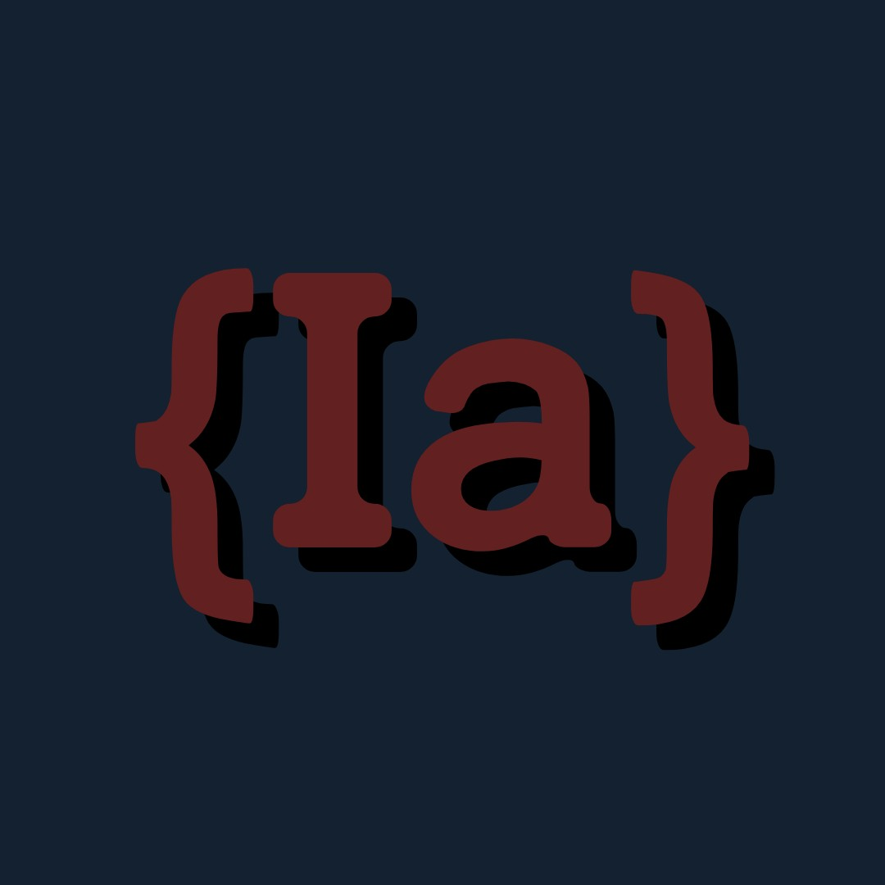

<!--
*** Thanks for checking out the Best-README-Template. If you have a suggestion
*** that would make this better, please fork the repo and create a pull request
*** or simply open an issue with the tag "enhancement".
*** Don't forget to give the project a star!
*** Thanks again! Now go create something AMAZING! :D
-->

<!-- PROJECT SHIELDS -->
<!--
*** I'm using markdown "reference style" links for readability.
*** Reference links are enclosed in brackets [ ] instead of parentheses ( ).
*** See the bottom of this document for the declaration of the reference variables
*** for contributors-url, forks-url, etc. This is an optional, concise syntax you may use.
*** https://www.markdownguide.org/basic-syntax/#reference-style-links
-->
<!-- [![Contributors][contributors-shield]][contributors-url] -->
[![Forks][forks-shield]][forks-url]
[![Stargazers][stars-shield]][stars-url]
[![Issues][issues-shield]][issues-url]
[![GitHub release (latest by date including pre-releases)][releases-shield]][releases-url]
[![GitHub commit activity][commits-shield]][commits-url]

<!-- PROJECT LOGO -->
 

  

<h3 align="center">Inside Agent Bot</h3>

  

    Discord Audio Player & More.
     
    <a href="https://github.com/InsideAgent/DiscordBot"><strong>Explore the docs »</strong></a>
     
     
    <a href="https://github.com/InsideAgent/DiscordBot">View Demo</a>
    ·
    <a href="https://github.com/InsideAgent/DiscordBot/issues">Report Bug</a>
    ·
    <a href="https://github.com/InsideAgent/DiscordBot/issues">Request Feature</a>
  

<!-- TABLE OF CONTENTS -->

  
Table of Contents

  <ol>
    <li>
      <a href="#about-the-project">About The Project</a>
      <ul>
        <li><a href="#built-with">Built With</a></li>
      </ul>
    </li>
    <li>
      <a href="#getting-started">Getting Started</a>
    </li>
    <li><a href="#usage">Usage</a></li>
    <li><a href="#roadmap">Roadmap</a></li>
    <li><a href="#contributing">Contributing</a></li>
    <li><a href="#license">License</a></li>
    <li><a href="#contact">Contact</a></li>
    <li><a href="#acknowledgments">Acknowledgments</a></li>
  </ol>

<!-- ABOUT THE PROJECT -->
## About The Project

This project started as a personal challenge/venture, but when I realized how much it helped my close friends discord server. I decided I wanted to make the project more professional, and above all, OPEN SOURCE!

(<a href="#top">back to top</a>)

### Built With

* [Java](https://java.com/)
* [JDA-Discord](https://github.com/DV8FromTheWorld/JDA)
* [LavaPlayer](https://github.com/sedmelluq/lavaplayer)
* [LavaPlayer-Fork](https://github.com/Walkyst/lavaplayer-fork)
* [Java-MySQL](https://mvnrepository.com/artifact/mysql/mysql-connector-java)
* [Icecast](https://icecast.org/)

(<a href="#top">back to top</a>)

<!-- GETTING STARTED -->
## Getting Started

To add this bot to your own discord server, simply click this [link](https://discord.com/api/oauth2/authorize?client_id=786721755560804373&permissions=8&scope=bot) and it choose the server you would like the bot in! 

And just like that the bot is ready to go!

(<a href="#top">back to top</a>)

<!-- USAGE EXAMPLES -->
## Usage

On startup of the bot, you will want to use `!registerguild` to make sure your guild is indexed in our databases! If your server supports private threads also be sure to use `!setticketchannel` in the channel of your choice for tickets to be created.

#### Current Command List for AudioPlayer:

- `-play` - Add a link to most streaming platforms, or use its name to search!
- `-skip` - Skips the current song!
- `-volume` - a number 1-100 to adjust volume!
- `-clear` - clears the current queue!
- `-stop` or `-pause` - pauses the current playing audio!
- `-resume` - resumes the current queue!
- `-disconnect` or `-dc` or `-leave` - disconnects the bot from its channel!
- `-follow` or `-move` moves the bot to your current channel!
- `-queue` or `-q`  - Shows a Embed of songs (10 per page) with page selectors, and a button to remove the message!
- `-shuffle` - Shuffles the queue!
- `-song` or `-info` - Shows info about the song, including a progress bar, the song requester, and Title/Author!
- `-remove` - Removes a song from the queue at a given index number!
- `-seek` - Takes in arg in the form of `HH:mm:ss` that seeks to that time in the current song!
- `-fix` - Resets the VoiceChannel's region to help reduce latency and audio lag.
- `-loop` - Args are either `song` or `queue` to loop a song or to loop the entire queue! (_Skipping resets any loops!_)
- `-move` - Intakes to numbers and swaps their positions in the queue!
- `-hijack` - Secret Command 🤫**Only Accessible by certified DJ's!**
- `-playtop` or `-ptop` - Adds a song to the top of the queue.

_For more examples, please refer to the Docs *COMING SOON*

(<a href="#top">back to top</a>)

<!-- ROADMAP -->
## Roadmap

- [ ] ~~Complete Core AudioPlayer Features~~
- [ ] Add supplemental features to AudioPlayer
- [ ] Complete GameSpy
    - [ ] Log specific games, and give weekly reports
- [ ] New Features, feature requests.

See the [open issues](https://github.com/InsideAgent/DiscordBot/issues) for a full list of proposed features (and known issues).

(<a href="#top">back to top</a>)

<!-- CONTRIBUTING -->
## Contributing

Contributions are what make the open source community such an amazing place to learn, inspire, and create. Any contributions you make are **greatly appreciated**.

If you have a suggestion that would make this better, please fork the repo and create a pull request. You can also simply open an issue with the tag "enhancement".
I will be actively reading requests, and updating the project with new features, so please do make requests if you can think of any features you would like to see.

Don't forget to give the project a star! Thanks again!

1. Fork the Project
2. Create your Feature Branch (`git checkout -b feature/AmazingFeature`)
3. Commit your Changes (`git commit -m 'Add some AmazingFeature'`)
4. Push to the Branch (`git push origin feature/AmazingFeature`)
5. Open a Pull Request

(<a href="#top">back to top</a>)

<!-- LICENSE -->
## License

Distributed under the MIT License. See `LICENSE.txt` for more information.

(<a href="#top">back to top</a>)

<!-- CONTACT -->
## Contact

Your Name - [@twitter_handle](https://twitter.com/JacrispyDev) - jacrispysyt@gmail.com

Project Link: [https://github.com/InsideAgent/DiscordBot](https://github.com/InsideAgent/DiscordBot)

(<a href="#top">back to top</a>)

<!-- ACKNOWLEDGMENTS -->
## Acknowledgments

* [Jacrispys - Lead Designer and Creator](https://github.com/Jacrispys)
* [Stilin - Ideas and feature brainstorming ](discordapp.com/users/972699606012031026)

(<a href="#top">back to top</a>)

<!-- MARKDOWN LINKS & IMAGES -->
<!-- https://www.markdownguide.org/basic-syntax/#reference-style-links -->
[contributors-shield]: https://img.shields.io/github/contributors/InsideAgent/DiscordBot.svg?style=for-the-badge
[contributors-url]: https://github.com/InsideAgent/DiscordBot/graphs/contributors
[forks-shield]: https://img.shields.io/github/forks/InsideAgent/DiscordBot.svg?style=for-the-badge
[forks-url]: https://github.com/InsideAgent/DiscordBot/network/members
[stars-shield]: https://img.shields.io/github/stars/InsideAgent/DiscordBot.svg?style=for-the-badge
[stars-url]: https://github.com/InsideAgent/DiscordBot/stargazers
[issues-shield]: https://img.shields.io/github/issues/InsideAgent/DiscordBot.svg?style=for-the-badge
[issues-url]: https://github.com/InsideAgent/DiscordBot/issues
[license-shield]: https://img.shields.io/github/license/InsideAgent/DiscordBot.svg?style=for-the-badge
[license-url]: https://github.com/InsideAgent/DiscordBot/blob/master/LICENSE.txt
[releases-shield]: https://img.shields.io/github/v/release/InsideAgent/DiscordBot?include_prereleases&style=for-the-badge
[releases-url]: https://github.com/InsideAgent/DiscordBot/releases
[commits-shield]: https://img.shields.io/github/commit-activity/m/InsideAgent/DiscordBot?style=for-the-badge
[commits-url]: https://github.com/InsideAgent/DiscordBot/commits/master
[product-screenshot]: images/screenshot.png

